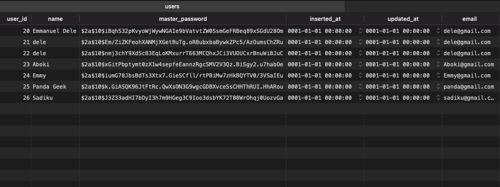

## PASSWORD MANAGER REST API

Rest API for password manager powering the storing and retrieval of records in a safe manner. User login passwords are hashed using the SHA 256 algorithm and record passwords are encrypted using the AES encryption algorithm so they can retrieved back in human-readable form. 

[Link to frontend](https://github.com/Shoetan/PassINFE)

## TECH STACK 
* Golang
* Docker
* PostgreSQL
* JWT
* GOOSE (Database migrations)

## ENDPOINTS 
* Login
* Register
* Patch 
* Add Record
* Delete Record

## How it works 
Registration endpoint takes a body as JSON of name, email, and password. The password is hashed using the SHA 256 algorithm to ensure safety.

